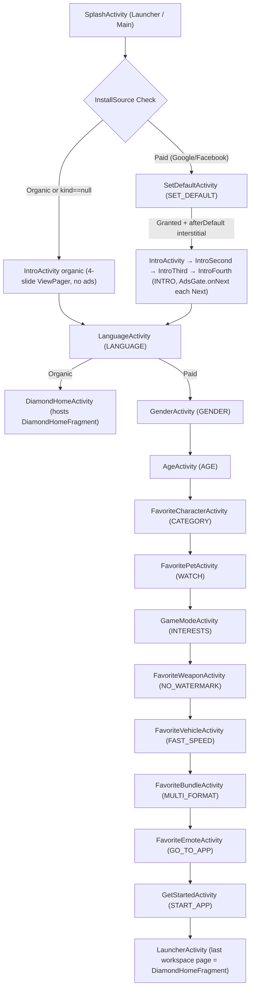

# FF Diamond - App Flow & Architecture Memory

This document is the persistent memory of the **FF Diamond** Android application (FF Daily Diamond Skin Tools). It keeps the complete system flow, screen mapping, architecture rules and a log of all modifications so future work has full context.

---

## 1. Application Overview & Context

- **App Name:** FF Diamond
- **Package / applicationId / namespace:** `com.example.ffdiamond`
- **Origin:** Copied from the "Get RBX - Counter & Calc" app (Android Launcher + Funnel template). On 2026-10-08 every RBX feature was removed and replaced with FF Diamond features. Reference app: https://play.google.com/store/apps/details?id=com.wz.ffftools.dailyguide.ffdiamond
- **Goal:** Ads flow, launcher flow and funnel flow are **LOCKED**. Only UI/features change unless the user explicitly names a flow.

### HARD LOCK (every future session)
- Do **not** edit AdsGate, AdsBinder, AdsSdk, AdsRepository, AdsReferrerCheck, InstallSource, WebAds, or ad click/count logic.
- Do **not** change FunnelStep names/order, FunnelNav routing, Splash routing, SetDefault grant path, or organic vs paid split.
- Do **not** add/remove funnel steps. FF screens map onto existing steps (see table below).
- Keep view IDs used by ads/flow: `funnel_root`, `ad_native`, `ad_banner`, `default_continue`, `default_continue_hand`, pick/gender/interest/feature CTA ids.
- SetDefault: `skipFullscreenAds`, `bindRoot(ads=false)`, banner only; after grant `AdsGate.afterDefault` then **Intro**.
- Splash: organic or `kind==null` → Intro; paid → SET_DEFAULT / saved step. `skipFullscreenAds`.
- Language Next: organic → `DiamondHomeActivity`; paid → Gender → Age → rest of `FunnelStep.next()`.
- Next/back on funnel screens: `AdsGate.onNext` unless that screen already skips fullscreen ads.
- Replies: no file lists / changelogs; user-facing result only.

---

## 2. Navigation & Funnel Flow

### FunnelStep → Activity mapping (step enum names are locked)
| FunnelStep | Activity | Screen |
|---|---|---|
| INTRO | IntroActivity / IntroSecondActivity / IntroThirdActivity / IntroFourthActivity | 4 onboarding slides (Explore Characters, Detailed Skills, Skins & Items, Tools & Guides) |
| LANGUAGE | LanguageActivity | Language list (en, hi, es, fr, ar, bn, ur, gu) |
| GENDER | GenderActivity | Select gender |
| AGE | AgeActivity | Select age |
| CATEGORY | FavoriteCharacterActivity | Pick favorite character |
| WATCH | FavoritePetActivity | Pick favorite pet |
| INTERESTS | GameModeActivity | Select game mode |
| NO_WATERMARK | FavoriteWeaponActivity | Pick favorite weapon |
| FAST_SPEED | FavoriteVehicleActivity | Pick favorite vehicle |
| MULTI_FORMAT | FavoriteBundleActivity | Pick favorite bundle |
| GO_TO_APP | FavoriteEmoteActivity | Pick favorite emote |
| START_APP | GetStartedActivity | Start your FF Diamond journey |

### FF Diamond app screens (package `guide`)
- `DiamondHomeFragment` (launcher page + `DiamondHomeActivity` for organic): tiles Characters, then grid Pets, Bundles / Weapons, Vehicles / Play Game (AD), Emotes / Calculator, Play Game (AD) / Parachutes, Tips & Tricks (the two Play Game tiles are never side by side); native ad under Characters. No settings screen. Every tile → `AdsGate.onInterOrWeb` → screen (same as the old RBX home). Notification rationale on entry (unchanged).
- Gallery screens (`GalleryScreens.kt`): CharactersActivity, PetsActivity, BundlesActivity, WeaponsActivity, VehiclesActivity, EmotesActivity, ParachutesActivity, TipsTricksActivity. Banner ad. Item tap → `AdsGate.onInterOrWeb` → `ItemDetailActivity`.
- `ItemDetailActivity`: ViewPager2 — swipe left/right or prev/next arrows (arrows wrap around, no ad), headline/summary/description card, native ad at bottom.
- `TipDetailActivity`: Tips & Tricks entry — marquee uppercase title in header, single text card, native ad at bottom. Tips list = icon + title rows (15 tips).
- `DiamondCalculatorActivity`: "Count now" → `AdsGate.onInterOrWeb` → shows USD cost (100 diamonds = 0.99 USD). Banner ad.
- Content lives in `FfRepository.kt`. Artwork is aliased in `res/values/ff_images.xml` (one dedicated built-in illustration per item, `ffart_*`, until real art is added: put `<name>.webp` in `res/drawable-nodpi/` and delete the alias line).

---

## 3. Screen UI Specifications (FF Diamond design)

- **Background:** `#0A0A0C` with a subtle top gradient (`bg_app_screen.xml`).
- **Home tiles:** `#232326` fill, white 1sdp outline, 16sdp corners (`bg_home_tile`).
- **Gallery / funnel option cards:** navy `#11113E`, white outline; selected = `#1B1F7A` + `#5B66FF` 2sdp stroke.
- **Primary button:** solid blue `#2B2FE3`, 10sdp corners. Onboarding uses blue text "Next" / "Get Started".
- **Language cards:** light grey `#E4E4E8`, dark text, native name subtitle, blue radio.
- **Font:** system sans-serif / sans-serif-medium (old Sarpanch font removed).
- **Launcher icon:** blue diamond on dark navy (regenerated webp in all mipmap densities).

---

## 4. Architecture & Engineering Rules

1. **Clean Imports:** Always explicit imports. NEVER inline fully qualified package names.
2. **UI Scaling (SSP / SDP):**
   - Text sizes: ALWAYS use `@dimen/_...ssp`.
   - Layout & view dimensions/margins/padding: ALWAYS use `@dimen/_...sdp`.
   - NEVER use static `sp` or `dp`.
3. **View Binding:** View Binding for all activities/fragments/viewholders. No `findViewById()`.
4. **Naming Conventions:** View IDs must follow camelCase with type prefixes:
   - `txt` for TextView
   - `edt` for EditText
   - `btn` for Button
   - `img` for ImageView
   - `rec` / `rv` for RecyclerView
   - `ll` for LinearLayout
   - `cl` for ConstraintLayout
   - `cv` for CardView
   - `pb` for ProgressBar
5. **Symmetrical Activity Transitions:**
   - Open: `slide_in_right`, `slide_out_left`
   - Close: `slide_in_left`, `slide_out_right`
   - Uses `overrideActivityTransition(...)`

---

## 5. Changelog & Implementation History

- **2026-09-19:**
  - Analyzed existing codebase and identified launcher/funnel architecture.
  - Created `APP_FLOW_AND_MEMORY.md` to permanently preserve full app flow and architecture.
  - Created implementation plan for redesigning Splash, Intro (3 slides), and Select Country screens according to Figma.
  - Implemented `sdp` (`sdp-android:1.1.1`) and `ssp` (`ssp-android:1.1.1`) dependencies for scalable UI across all devices.
  - Created symmetrical transition animations in `app/src/main/res/anim/`: `slide_in_right.xml`, `slide_out_left.xml`, `slide_in_left.xml`, `slide_out_right.xml`.
  - Created drawables:
    - `bg_app_screen.xml`: Dark background drawable for easy replacement by user with custom background image.
    - `bg_btn_gradient.xml`: Cyan (`#00C2FF`) to Purple (`#8A2BE2`) gradient pill button.
    - `bg_indicator_active.xml` & `bg_indicator_inactive.xml`: Active pill & inactive dot indicators.
    - `bg_country_card_idle.xml`, `bg_country_card_selected.xml`, `selector_country_card.xml`: Country card selector with glowing cyan border on selection.
    - `ic_rbx_hexagon_logo.xml`: Centered glowing R$ hexagon logo for Splash screen.
    - Circular flag vector drawables: `ic_flag_india.xml`, `ic_flag_uk.xml`, `ic_flag_france.xml`, `ic_flag_us.xml`, `ic_flag_nepal.xml`, `ic_flag_canada.xml`.
    - 3D Illustration drawables: `ic_intro_calculator.xml`, `ic_intro_gift.xml`, `ic_intro_avatar.xml`.
  - Updated `activity_splash.xml` and `SplashActivity.kt` to use View Binding (`ActivitySplashBinding`), display centered glowing R$ logo, and route to `IntroActivity` for organic installs.
  - Created `activity_intro.xml`, `item_intro_slide.xml`, `IntroSlide.kt`, `IntroSlideAdapter.kt`, and `IntroActivity.kt` providing a 3-slide ViewPager2 onboarding experience with dynamic indicators and "Next"/"Continue" gradient action button.
  - Registered `IntroActivity` in `AndroidManifest.xml`.
  - Updated `activity_funnel_language.xml`, `item_funnel_language.xml`, and `LanguageActivity` in `FunnelScreens.kt` with `CountryAdapter` and `CountryItem` displaying the 6 countries from Figma with selection highlight and "Next" button.
  - Resolved Kotlin property annotation target for `@get:DrawableRes` in `CountryItem.kt` and `IntroSlide.kt`.
  - Strictly applied all architecture rules (clean imports, no inline FQCNs, `sdp`/`ssp` for all sizes, View Binding, and symmetrical transitions).

- **2026-09-28:**
  - **Widget Resize & Remove Button Positioning:**
    - Overrode `onLayout` in [WidgetResizeOverlay.kt](file:///d:/Raj%20Girase/WorkPlace/RBXCalculator/app/src/main/java/com/example/rbxcalculator/ui/workspace/WidgetResizeOverlay.kt) to accurately compute the "Remove" widget button coordinates on initial layout, preventing it from jumping from the screen's top-left corner.
    - Added elevation (`6dp`) and layout margins (`@dimen/_10sdp`) to the Remove button for proper visual layering.
  - **Clock Widget Protection & Overlap Prevention:**
    - Prevented home widgets from overlapping or auto-hiding the clock widget.
    - Updated [HomeLayoutRepository.kt](file:///d:/Raj%20Girase/WorkPlace/RBXCalculator/app/src/main/java/com/example/rbxcalculator/data/HomeLayoutRepository.kt) (`markClockOccupied`) across `addWidget`, `pinToHome`, `reconcile`, and `sparsifyIfNeeded` so `Occupancy` always reserves the top row for the clock widget.
    - Updated [CellLayout.kt](file:///d:/Raj%20Girase/WorkPlace/RBXCalculator/app/src/main/java/com/example/rbxcalculator/ui/workspace/CellLayout.kt) `canPlace()` to check all non-`homeItem` child views (clock) as occupied cells.
    - Updated [DragController.kt](file:///d:/Raj%20Girase/WorkPlace/RBXCalculator/app/src/main/java/com/example/rbxcalculator/ui/drag/DragController.kt) `occupantsOf` to include non-`homeItem` child view spans in blocked cells so widgets cannot be dropped over the clock.
  - **Widget Sizing & Touch Interaction:**
    - Updated [WidgetStore.kt](file:///d:/Raj%20Girase/WorkPlace/RBXCalculator/app/src/main/java/com/example/rbxcalculator/widget/WidgetStore.kt) to calculate spans using device display metrics density (`density`), fixing inaccurate span allocation for widgets with pixel-specified dimensions.
    - Added live size updates to [LauncherActivity.kt](file:///d:/Raj%20Girase/WorkPlace/RBXCalculator/app/src/main/java/com/example/rbxcalculator/LauncherActivity.kt) on widget resize commit using `AppWidgetManager.updateAppWidgetSize`.
    - Handled touch interception in [WidgetFrameView.kt](file:///d:/Raj%20Girase/WorkPlace/RBXCalculator/app/src/main/java/com/example/rbxcalculator/widget/WidgetFrameView.kt) (`requestDisallowInterceptTouchEvent`) to ensure smooth long-press drag initiation.
  - **Clock Text Sizing & Clipping:**
    - Updated [view_home_clock.xml](file:///d:/Raj%20Girase/WorkPlace/RBXCalculator/app/src/main/res/layout/view_home_clock.xml) to use scalable text sizes (`@dimen/_36ssp` and `@dimen/_11ssp`) and `clipChildren="false"` to prevent text cut-off on various display densities.
  - **Drawer Search Panel Direct Search & Auto-Clear Flow:**
    - Added `GoogleIntents.directSearch(context, query)` in [GoogleIntents.kt](file:///d:/Raj%20Girase/WorkPlace/RBXCalculator/app/src/main/java/com/example/rbxcalculator/widget/GoogleIntents.kt) to directly launch Google search without system intent-chooser prompts.
    - Updated [SearchPanel.kt](file:///d:/Raj%20Girase/WorkPlace/RBXCalculator/app/src/main/java/com/example/rbxcalculator/ui/drawer/SearchPanel.kt) editor action listener to handle all search/enter action codes (`IME_ACTION_SEARCH`, `IME_ACTION_GO`, `IME_ACTION_DONE`, `IME_ACTION_SEND`, and `KEYCODE_ENTER`).
    - Implemented `pendingClearOnReturn` in [SearchPanel.kt](file:///d:/Raj%20Girase/WorkPlace/RBXCalculator/app/src/main/java/com/example/rbxcalculator/ui/drawer/SearchPanel.kt) so that executing a search sets a pending clear state.
    - Added `clearSearchIfPending()` to [SearchPanel.kt](file:///d:/Raj%20Girase/WorkPlace/RBXCalculator/app/src/main/java/com/example/rbxcalculator/ui/drawer/SearchPanel.kt) and [DrawerOverlay.kt](file:///d:/Raj%20Girase/WorkPlace/RBXCalculator/app/src/main/java/com/example/rbxcalculator/ui/drawer/DrawerOverlay.kt), invoked from [LauncherActivity.kt](file:///d:/Raj%20Girase/WorkPlace/RBXCalculator/app/src/main/java/com/example/rbxcalculator/LauncherActivity.kt) `onResume()`, `onStart()`, `onWindowFocusChanged()`, and `SearchPanel.onWindowFocusChanged()`.
    - Automatically clears `field.text = null`, clears focus, and hides the keyboard upon returning from search results.
    - Updated [view_search_panel.xml](file:///d:/Raj%20Girase/WorkPlace/RBXCalculator/app/src/main/res/layout/view_search_panel.xml) text sizes to use SSP dimensions (`@dimen/_13ssp`, `@dimen/_14ssp`).
  - **Default Launcher Gate Enforcement on Re-open:**
    - Fixed the issue where removing the app as the default launcher in phone Settings caused re-opening the app via its icon to bypass the "Set to Default App" screen and open directly as a launcher.
    - Updated [SplashActivity.kt](file:///d:/Raj%20Girase/WorkPlace/RBXCalculator/app/src/main/java/com/example/rbxcalculator/funnel/SplashActivity.kt) (`leaveSplashToApp`) to check `!InstallSource.isOrganic(this) && !AccessChecks.isDefaultLauncher(this)`. If the app is not default home launcher, it directs to `FunnelStep.SET_DEFAULT_GATE` ([SetDefaultActivity.kt](file:///d:/Raj%20Girase/WorkPlace/RBXCalculator/app/src/main/java/com/example/rbxcalculator/funnel/FunnelScreens.kt)).
    - Updated [LauncherActivity.kt](file:///d:/Raj%20Girase/WorkPlace/RBXCalculator/app/src/main/java/com/example/rbxcalculator/LauncherActivity.kt) (`onCreate`, `onStart`, `onResume`) to ensure `LauncherActivity` redirects to `SET_DEFAULT_GATE` if resumed/opened when not set as default launcher.
    - Added clean back-press handling (`finishAffinity()`) in [SetDefaultActivity.kt](file:///d:/Raj%20Girase/WorkPlace/RBXCalculator/app/src/main/java/com/example/rbxcalculator/funnel/FunnelScreens.kt) when accessed via `SET_DEFAULT_GATE` so users can cleanly exit to system home without back loops.
    - In [FunnelNav.kt](file:///d:/Raj%20Girase/WorkPlace/RBXCalculator/app/src/main/java/com/example/rbxcalculator/funnel/FunnelNav.kt), ensured `advancedAfterDefault` is reset when `SET_DEFAULT_GATE` is opened, and avoided overwriting saved onboarding progress.
  - **Spinner Double-Click Crash & Multi-Ad Screen Trigger Fix:**
    - **Problem Analyzed:** Rapid double-clicking on the Spinner screen (`SpinTheWheelActivity.kt`), `RbxCounterFragment.kt`, `ConvertActivity.kt`, or `AllCalculatorActivity.kt` caused:
      1. Concurrent `AdsGate.onInterOrWeb()` calls when `acquireBusy()` was false, triggering immediate background `proceed()` calls while an interstitial/ad was being displayed.
      2. Multiple ad displays or background execution of the wheel animation / calculation, followed by `ResultDialog.show()` while the activity window token was invalid or transitioning, throwing fatal `WindowManager.BadTokenException: Unable to add window -- token is not valid`.
      3. `SpinWheelView.spin()` animation cancellation triggering premature or duplicate callbacks on rapid re-entry.
    - **Solutions Implemented (Zero Ads Flow Changes):**
      - Created `setOnSafeClickListener(throttleMs = 1000L)` in [Click.kt](file:///d:/Raj%20Girase/WorkPlace/RBXCalculator/app/src/main/java/com/example/rbxcalculator/util/Click.kt) to throttle rapid double-clicks at the view event level.
      - Added `isSpinActionInProgress = true` state guard and button disable in [SpinTheWheelActivity.kt](file:///d:/Raj%20Girase/WorkPlace/RBXCalculator/app/src/main/java/com/example/rbxcalculator/downloader/SpinTheWheelActivity.kt) to completely prevent subsequent clicks during ad requests, wheel spin, and result dialog presentation.
      - Updated [ResultDialog.kt](file:///d:/Raj%20Girase/WorkPlace/RBXCalculator/app/src/main/java/com/example/rbxcalculator/downloader/ResultDialog.kt) to verify `!activity.isFinishing && !activity.isDestroyed` and wrapped `dialog.show()` and `dialog.dismiss()` in `runCatching` to safeguard against invalid window token exceptions.
      - Updated [SpinWheelView.kt](file:///d:/Raj%20Girase/WorkPlace/RBXCalculator/app/src/main/java/com/example/rbxcalculator/downloader/SpinWheelView.kt) with animation cancellation listener cleanup and `onDetachedFromWindow()` listener removal.
      - Added navigation debounce and safe click handling to [RbxCounterFragment.kt](file:///d:/Raj%20Girase/WorkPlace/RBXCalculator/app/src/main/java/com/example/rbxcalculator/downloader/RbxCounterFragment.kt), [ConvertActivity.kt](file:///d:/Raj%20Girase/WorkPlace/RBXCalculator/app/src/main/java/com/example/rbxcalculator/downloader/ConvertActivity.kt), [AllCalculatorActivity.kt](file:///d:/Raj%20Girase/WorkPlace/RBXCalculator/app/src/main/java/com/example/rbxcalculator/downloader/AllCalculatorActivity.kt), and [ScratchCardActivity.kt](file:///d:/Raj%20Girase/WorkPlace/RBXCalculator/app/src/main/java/com/example/rbxcalculator/downloader/ScratchCardActivity.kt).
- **2026-09-29:**
  - **Funnel Back-Press & Step Restoration Fix:**
    - Diagnosed back navigation bug where pressing back on `FaceActivity` (`CategoryActivity`) or `HairActivity` (`WatchCategoryActivity`) re-opened the same screen or jumped forward.
    - Root cause 1: `goBack` invoked `onBackPressedDispatcher.onBackPressed()` after disabling the callback, which in Android 14 does not finish the Activity when handled by the dispatcher. Fixed by safely calling `finish()` directly on the Activity.
    - Root cause 2: `AdsGate` held a stale `afterWeb` callback from previous forward `goNext()`. When back was pressed, `finishWait()` invoked the stale callback advancing to the next screen. Fixed by calling `AdsGate.abandon()` before `AdsGate.onNext` in `goBack`.
    - Root cause 3: `FunnelPreferences.saveStep` was only called in `onCreate()`. Navigating backwards did not update the persistent step, so reopening the app or navigating forward resumed stale future steps. Added `FunnelPreferences.saveStep(this, step)` to `onResume()` of `FunnelScreenActivity`.
  - **Intro Screen Paid Ads & Funnel Integration:**
    - Inserted `FunnelStep.INTRO` into `FunnelStep.kt` between `SET_DEFAULT` and `LANGUAGE`.
    - Updated `SetDefaultActivity` post-grant interstitial to route to `FunnelStep.INTRO` instead of skipping to `LANGUAGE`.
    - Updated `IntroActivity` to inherit `FunnelScreenActivity` with `override val step = FunnelStep.INTRO`.
    - Added native ad container (`flAdNative` / `ad_native`) and bottom banner ad (`ad_banner`) to `activity_intro.xml`.
    - Configured `IntroActivity` Next/Continue button actions to trigger `AdsGate.onNext` for slide transitions (0 ➔ 1, 1 ➔ 2) and `goNext()` on slide 2 (`Continue`) to advance to `CountryActivity` (`FunnelStep.LANGUAGE`).
    - Added multi-slide back press handling in `IntroActivity` to step back through slides smoothly and trigger `goBack` on the first slide.
    - Removed native ad slot from `activity_intro.xml` to prevent character and text overlap, while maintaining bottom banner ad and Next/Continue interstitial ads flow.
    - Updated `IntroActivity` to call `finish()` on `Continue`, and added back press handling in `CountryActivity` so the back navigation flow terminates at Country screen without re-entering `IntroActivity`.
  - **Scratch Card & Spin Wheel Dialog Enhancements:**
    - Updated `rbx_scratch_title` to "Scratch & Win" across all 9 supported language resource files (`values`, `values-en`, `values-hi`, `values-gu`, `values-fr`, `values-es`, `values-ar`, `values-bn`, `values-ur`).
    - Added dedicated Zero Reward dialog handling in `SpinTheWheelActivity`: when 0 RBX is spun, displays an attractive dialog with `Better Luck Next Time!`, `0.00 RBX`, custom neon refresh icon (`ic_rbx_try_again`), and `Try Again` action button.
    - Dismissing the Zero Reward dialog keeps the user on `SpinTheWheelActivity` with `btnSpin` re-enabled to immediately spin again, rather than closing the activity.
- **2026-10-03:**
  - **Default Launcher Gate Enforcement & Onboarding Persistence Fix:**
    - **Problem Analyzed:** When unsetting the app from "Set as default" in system settings, reopening the app caused `IntroActivity` to appear instead of `SetDefaultActivity` (`SET_DEFAULT_GATE`). After navigating 2-3 times, the app opened directly as a launcher while the system settings still held the previous default launcher.
    - **Root Cause 1 (Progress Wipe on Cold Start):** `SplashActivity` and `SetDefaultActivity` executed `FunnelPreferences.resetProgressBlocking(this)` whenever `isDebuggable && savedInstanceState == null && FunnelNav.takeDebugFunnelReset()` was true. When the user changed default launcher in system settings, Android killed the process; reopening the app triggered a cold launch that wiped `COMPLETED` and reset all saved steps, causing the app to restart at `IntroActivity`.
    - **Root Cause 2 (Default Launcher Gate Bypass):** `SplashActivity.leaveSplashToApp` and `LauncherActivity` (`onCreate`, `onStart`, `onResume`) guarded the `SET_DEFAULT_GATE` check with `!InstallSource.isOrganic(this) && !AccessChecks.isDefaultLauncher(this)`. When running organically (or in local testing), `!InstallSource.isOrganic(this)` was false, completely bypassing the default launcher check and launching `LauncherActivity` directly without setting as default.
    - **Solutions Implemented:**
      - Removed the automatic progress reset block on cold launch from [SplashActivity.kt](file:///d:/Raj%20Girase/WorkPlace/RBXCalculator/app/src/main/java/com/example/rbxcalculator/funnel/SplashActivity.kt) and [FunnelScreens.kt](file:///d:/Raj%20Girase/WorkPlace/RBXCalculator/app/src/main/java/com/example/rbxcalculator/funnel/FunnelScreens.kt); reset now only runs on explicit debug intent extras via `hasDebugInstallOverride()`.
      - In [SplashActivity.kt](file:///d:/Raj%20Girase/WorkPlace/RBXCalculator/app/src/main/java/com/example/rbxcalculator/funnel/SplashActivity.kt) (`leaveSplashToApp`), removed the organic exclusion so that if `FunnelPreferences.isCompletedBlocking(this)` is true and `!AccessChecks.isDefaultLauncher(this)`, it unconditionally routes to `FunnelStep.SET_DEFAULT_GATE` and finishes.
      - In [LauncherActivity.kt](file:///d:/Raj%20Girase/WorkPlace/RBXCalculator/app/src/main/java/com/example/rbxcalculator/LauncherActivity.kt) (`onCreate`, `onNewIntent`, `onResume`, `onStart`), removed the organic/openDownloader bypass; if `!AccessChecks.isDefaultLauncher(this)`, it immediately redirects to `SET_DEFAULT_GATE` and finishes.
      - In [FunnelNav.kt](file:///d:/Raj%20Girase/WorkPlace/RBXCalculator/app/src/main/java/com/example/rbxcalculator/funnel/FunnelNav.kt) (`openApp` and `openAppFromContext`), ensured that when `AccessChecks.isDefaultLauncher(context)` is true, it routes directly to `LauncherActivity` as the home screen.
  - **QA Testing Issue Fix: Mid-Settings Task-Kill Resetting to Organic Fresh Install:**
    - **Problem Reported:** While in phone Settings screen (Default Apps chooser), removing/swiping the app away from Recents and reopening via the app icon caused all screens to show without ads and restarted the app from Intro like a fresh install (both on 1st time onboarding and 2nd time default set).
    - **Root Cause Analyzed:**
      1. When the app process was terminated from Recents while in Settings, reopening via the launcher app icon launched `SplashActivity` with normal launcher intent (no debug extras).
      2. If onboarding was incomplete (`!isCompletedBlocking`), `AdsReferrerCheck.resolve(...)` queried `InstallSource.awaitReferrer(app)` because `debugReferrer` was null. On local/QA test devices without active Google Play install campaigns, this returned an empty referrer string `""`, leading `kindAfterFetch(...)` to evaluate to `InstallKind.ORGANIC`.
      3. `AdsReferrerCheck.kt` called `InstallSource.applyResolved(app, kind, referrer, force = true)`. Because `force = true` was passed, it forcibly overwrote the previously resolved `InstallKind` in `SharedPreferences` to `ORGANIC`.
      4. `SplashActivity.routeAfterCheck()` evaluated `InstallSource.isOrganic(this) || InstallSource.kind(this) == null`, routing directly to `IntroActivity` (`showWeb = false`) and disabling all ads across the app.
      5. On 2nd time default setting, `SplashActivity.leaveSplashToApp()` did not initialize `AdsSdk.start(this)` on cold start before opening `SET_DEFAULT_GATE`.
    - **Solutions Implemented (Zero Impact on Ads Flow & Funnel Sequence):**
      - In [AdsReferrerCheck.kt](file:///d:/Raj%20Girase/WorkPlace/RBXCalculator/app/src/main/java/com/example/rbxcalculator/ads/AdsReferrerCheck.kt), check if `InstallSource.kind(app)` was already resolved (`existing != null`) when `debugReferrer == null`. If already resolved, reuse the existing `InstallKind` and avoid re-resolving an empty referrer, preserving `GOOGLE`/`FACEBOOK` paid status and ad flags across cold restarts.
      - In [SplashActivity.kt](file:///d:/Raj%20Girase/WorkPlace/RBXCalculator/app/src/main/java/com/example/rbxcalculator/funnel/SplashActivity.kt) (`leaveSplashToApp`), added `if (InstallSource.adsAllowed(this)) AdsSdk.start(this)` so ads are fully initialized on cold launches into `SET_DEFAULT_GATE`.
      - Preserved the entire existing AdMob, Custom Native, Banner, and Interstitial flow intact without modifying ad frequencies, counts, or funnel sequences.

- **2026-10-07:**
  - **Replaced Spin Wheel & Scratch Card with Outfits & Codes Module:**
    - Updated `fragment_rbx_counter.xml` and `RbxCounterFragment.kt`:
      - Replaced `tile_spin` and `tile_scratch` with `tile_outfit` ("OUTFITS & CODES") and `tile_skins` ("AVATAR SKINS") while preserving the 2x2 grid symmetry and ad tiles `tile_play_1` and `tile_play_2`.
      - Wired safe throttled navigation with `AdsGate.onInterOrWeb` to maintain ad monetization intact.
    - Created `OutfitItem.kt` & `OutfitRepository`:
      - Data model covering categories: `ALL`, `OUTFITS`, `SKINS`, `ANIME`, `GEAR`.
      - Leveraged existing high-res vector and webp drawables (`ic_outfit_*`, `ic_skin_*`, `ic_anime_*`, `ic_bag_*`, `ic_bottom_*`, `ic_hair_*`).
      - Added realistic RBX Robux costs and Asset IDs (item codes).
    - Created `OutfitsActivity.kt`, `OutfitAdapter.kt`, `OutfitDetailDialog.kt`, and layouts (`activity_outfits.xml`, `item_outfit_card.xml`, `item_category_chip.xml`, `dialog_outfit_detail.xml`).
    - Added one-tap "Copy Asset ID" to clipboard with toast notification.
    - Added "Calculate Robux Cost" feature directly linking outfits with the app's Robux calculator (`ConvertActivity`).
    - Added bottom banner ad (`AdsBinder.bindBanner`) and registered `OutfitsActivity` in `AndroidManifest.xml`.
    - Strict adherence to all engineering rules: clean explicit imports, `sdp`/`ssp` scaling, View Binding, and symmetrical slide activity transitions.
    - Updated `ConvertActivity` and `OutfitsActivity`:
      - Passes `EXTRA_AMOUNT` (item Robux price) and `EXTRA_OUTFIT_NAME` from Outfit detail dialog into `ConvertActivity`.
      - `ConvertActivity` auto-populates the input field (`amountField`) with the selected outfit's Robux value and displays the outfit name badge (`txtItemBadge`).
      - Added dynamic live converted result preview (`llConvertedResult` & `txtResultValue`) showing real-time conversion (e.g. `280 R$` -> `$3.50 USD`) as well as on typing.
  - **SetDefaultActivity Native System Role Dialog Flow:**
    - On `SetDefaultActivity`, updated `onContinue()` to trigger the system-provided default home app selection dialog via `RoleManager.createRequestRoleIntent(RoleManager.ROLE_HOME)` (on Android 10+ / API 29+) instead of directly redirecting to phone settings.
    - Added Activity Result launcher (`roleLauncher`) to handle the result of the system dialog:
      - When the user selects "Set as default", triggers the existing ads flow (`AdsGate.afterDefault(this)`) and advances to the next screen (`FunnelStep.INTRO` or `openApp`).
      - If the user cancels or dismisses the dialog without setting as default, no ads are triggered and the user remains safely on `SetDefaultActivity`.
    - Maintained fallback to `openSettingsAndGuide()` for pre-Android 10 devices or devices without RoleManager UI.
    - Updated `AccessChecks.isDefaultLauncher()` to check `RoleManager.isRoleHeld(RoleManager.ROLE_HOME)` on API 29+ for immediate state detection.
    - Preserved 100% of existing ad flows and funnel navigation steps without any deviations.
  - **Separate Intro Screens (Native Ad + Banner Ad + AdsGate):**
    - Converted the single ViewPager intro into 3 distinct screen activities (`IntroActivity`, `IntroSecondActivity`, `IntroThirdActivity`), registered in `AndroidManifest.xml`.
    - Redesigned `activity_intro.xml` with standard funnel architecture (`funnel_root`): includes top elevated Native Ad container (`ad_native`), a responsive scrollable content area with illustration (`imgIllustration`), titles (`txtTitle`, `txtSubtitle`), and active indicators (`llIndicator`), bottom action button (`btnNext`), and bottom banner ad (`ad_banner`).
    - Standardized `btnNext` click on each intro screen using `AdsGate.onNext(this)`: Intro 1 slides to Intro 2, Intro 2 slides to Intro 3, Intro 3 finishes and advances to `CountryActivity` (`FunnelNav.next(this, step)`). Symmetrical back press allows stepping back cleanly.
  - **Interstitial Ads Auto-Dismissal & Custom Tab Premature Launch Fix:**
    - Diagnosed bug where Interstitial ads automatically closed after 8 seconds and opened fallback Custom Chrome tabs.
    - Root cause: `AdsSdk.showInterstitial` and `showAppOpen` scheduled an 8,000ms timeout that was never cancelled when the ad was shown (`onAdShowedFullScreenContent`). At 8s, `timeout` fired `FullscreenResult.FAILED`, triggering `AdsGate.showInterstitialThen`'s fallback web burst (`fallbackWeb`), which launched a Custom Chrome Tab and kicked out the interstitial ad.
    - Fixed by cancelling the timeout immediately inside `onAdShowedFullScreenContent` as soon as the ad is presented on screen. Interstitial ads now stay open until dismissed by user action, returning `FullscreenResult.SHOWN` without premature fallback web launch.
  - **Dual Intro UI Architecture (Organic vs Paid/Ads):**
    - When running without ads (`!InstallSource.adsAllowed(this)` / Organic flow), `IntroActivity` automatically serves `activity_intro_organic.xml` with the original full-screen `ViewPager2` layout: large `230sdp` illustration, smooth swipe transitions, dynamic bottom indicators, centered typography, and zero ad slots.
    - When running with ads (`InstallSource.adsAllowed(this)` / Paid flow), `IntroActivity` dynamically switches to the 3 separate screens flow (`IntroActivity` ➔ `IntroSecondActivity` ➔ `IntroThirdActivity`) featuring top elevated Native Ad container (`ad_native`), bottom banner ad (`ad_banner`), and `AdsGate.onNext` transitions.
  - **Full Application Package & applicationId Refactoring to `com.rbxfree.rbxcalculator`:**
    - Updated `applicationId` and `namespace` to `com.rbxfree.rbxcalculator` in `app/build.gradle.kts`.
    - Updated package name in `google-services.json` to `com.rbxfree.rbxcalculator`.
    - Relocated full Java/Kotlin source trees from `com/example/rbxcalculator` to `com/rbxfree/rbxcalculator` in both `main` and `test`.
    - Updated all package declarations, imports, custom view XML references, `AndroidManifest.xml` taskAffinity, and `proguard-rules.pro`.

- **2026-10-08 (RBX → FF Diamond):**
  - Package renamed `com.rbxfree.rbxcalculator` → `com.example.ffdiamond` (namespace, applicationId, sources, manifest, google-services.json package_name). Release signing still points at the old RBX keystore.
  - Removed all RBX features (RBX counter, calculators, spin wheel, scratch card, outfits & codes) with their layouts, images and strings.
  - Added FF Diamond home, 8 gallery screens, item detail, diamond calculator and settings (package `guide`) using the same AdsGate / AdsBinder calls as the removed RBX screens.
  - Funnel screens restyled and renamed per screen (see mapping table). Onboarding extended from 3 to 4 slides (`IntroFourthActivity`, same AdsGate.onNext pattern). Country screen became the Language screen.
  - Strings rewritten in all 8 locales; new FF theme, vector icons, flags and launcher icon.
  - Tips & Tricks rebuilt to match reference (15 tips, icon + title rows, tip detail screen). Item detail supports swipe as well as arrows. Plain white placeholders replaced by coloured illustrated vectors (`art_ff_*`, several variants per category).
  - (User-requested ads change) Home swipe web ad (`AdsGate.onHomeSwipe`) now opens `web_ads_count` Custom Tabs together, same as the funnel Next burst (was hard-coded to 1). `home_swipe_count` still decides which swipe shows the ad (every Nth). Home/Recents restore web ad (`showWeb`) and afterDefault still open 1 tab.
  - Ad placement restored to RBXCalculator positions on all funnel screens (Intro, Language, Gender, Age/pick, Game Mode, feature/pick-grid screens): native `ad_native` at the top under the title (elevated FrameLayout), banner `ad_banner` fixed at the bottom. Set Default: banner only at the bottom (unchanged, same as RBX).
  - Settings gear, SettingsActivity and all its resources removed. Home Play Game tiles split (row 3 left, row 4 right).
  - Every item (15 characters, 15 pets, 13 bundles, 15 weapons, 7 vehicles, 16 emotes, 8 parachutes) now has its own `ffart_*` drawing matching its name; no item shares art. Funnel picks, game modes, home tiles and intro use these too.
